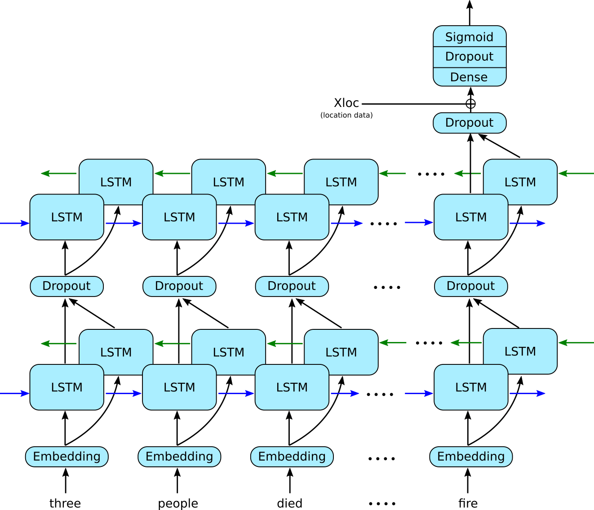

# Natural Language Processing with Disaster Tweets

This is the [Natural Language Processing with Disaster Tweets](https://www.kaggle.com/competitions/nlp-getting-started) competition.

The file [tweets_preprocessing.ipynb](tweets_preprocessing.ipynb) contains data cleaning and processing, in particular:
-  inferring location country from location data and from the text of the tweet,
-  tweet text cleaning and tokenization,
-  applying word embeddings using the GloVe dataset [glove.twitter.27B](https://nlp.stanford.edu/data/glove.twitter.27B.zip).

The cleaned data is subsequently fed into a recurrent neural net with two bidirectional LSTM layers shown in the schamtic picture below.

 

This can be found in the notebook [lstm.ipynb](lstm.ipynb).
